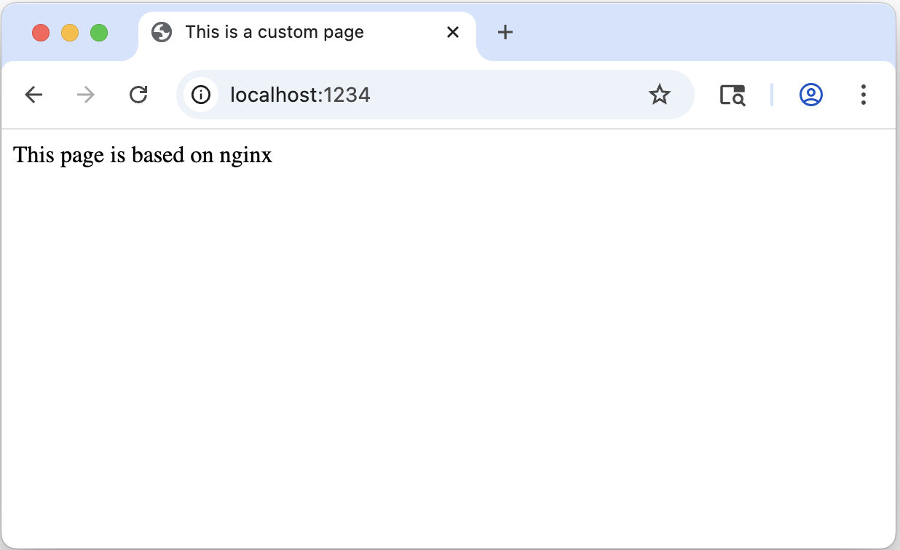

# 🎨 My Dev Atelier: 개발 환경 구축 기록<!-- omit in toc -->

개발 환경 구축 과정과 Git/GitHub 연동, 권한 관리 및 컨테이너 환경 설정을 기록한 기술 문서입니다.

---

# 1. 프로젝트 준비 및 환경 설정

## 1.1. 프로젝트 개요
본 프로젝트는 개발자의 핵심 도구인 터미널(CLI), Docker, Git을 활용하여 효율적이고 재현 가능한 개발 워크스테이션을 구축하는 것을 목표로 합니다. 
단순한 도구 설치를 넘어, 컨테이너 기술을 이용해 환경에 구애받지 않는 웹 서버를 배포하고 데이터 영속성을 직접 검증합니다. 
또한, Git과 GitHub을 연동하여 코드의 이력을 관리하고 협업의 기반을 마련하는 과정을 포함합니다. 
이 과정을 통해 '내 컴퓨터에서만 안 되는' 문제를 해결하고, 어떤 환경에서도 동일하게 동작하는 시스템 설계 사고방식을 학습합니다.

## 1.2. 실행 환경
- OS: macOS Sequoia (v15.7.4)
- Shell: /bin/zsh 
- Docker: 28.5.2
- Git: 2.53.0

## 1.3. 검증 방법


## 1.4. 체크리스트


## 1.5. 목차<!-- omit in toc -->
- [1. 프로젝트 준비 및 환경 설정](#1-프로젝트-준비-및-환경-설정)
  - [1.1. 프로젝트 개요](#11-프로젝트-개요)
  - [1.2. 실행 환경](#12-실행-환경)
  - [1.3. 검증 방법](#13-검증-방법)
  - [1.4. 체크리스트](#14-체크리스트)
- [2. 실습 과정 및 로그 기록](#2-실습-과정-및-로그-기록)
  - [2.1. 터미널 조작 로그](#21-터미널-조작-로그)
  - [2.2. 권한 관리 로그](#22-권한-관리-로그)
  - [2.3. Docker 설치 및 기본 점검](#23-docker-설치-및-기본-점검)
  - [2.4. Docker 기본 운영 명령 수행](#24-docker-기본-운영-명령-수행)
  - [2.5. 컨테이너 실행](#25-컨테이너-실행)
  - [2.6. 기존 Dockerfile 기반 커스텀 이미지 제작](#26-기존-dockerfile-기반-커스텀-이미지-제작)
  - [2.7. 포트 매핑 및 접속 결과](#27-포트-매핑-및-접속-결과)
  - [2.8. Docker 볼륨 영속성 검증](#28-docker-볼륨-영속성-검증)
  - [2.9. Git 설정 및 GitHub 연동](#29-git-설정-및-github-연동)
  - [2.10. Git 설정 및 GitHub 연동](#210-git-설정-및-github-연동)
- [3. 트러블 슈팅](#3-트러블-슈팅)

# 2. 실습 과정 및 로그 기록 

## 2.1. 터미널 조작 로그

### 2.1.1. 현재 위치 확인<!-- omit in toc -->
```bash
user /Users/Shared/user/my-dev-atelier % pwd
/Users/Shared/user/my-dev-atelier
```

### 2.1.2. 목록 확인(숨김 파일 포함)<!-- omit in toc -->
```bash
user /Users/Shared/user/my-dev-atelier % ls -a
.	..
```

### 2.1.3. 이동<!-- omit in toc -->
```bash
user /Users/Shared/user/my-dev-atelier % cd ..
user /Users/Shared/user % 
```

### 2.1.4. 생성<!-- omit in toc -->
```bash
user /Users/Shared/user/my-dev-atelier % mkdir test
user /Users/Shared/user/my-dev-atelier % ls -a
.	..	test
user /Users/Shared/user/my-dev-atelier % touch test.txt
user /Users/Shared/user/my-dev-atelier % ls -a
.		..		test		test.txt
```

### 2.1.5. 복사<!-- omit in toc -->
```bash
user /Users/Shared/user/my-dev-atelier % cp test.txt test2.txt
user /Users/Shared/user/my-dev-atelier % ls -a
.		..		test		test.txt	test2.txt
```

### 2.1.6. 이동/이름변경<!-- omit in toc -->
```bash
user /Users/Shared/user/my-dev-atelier % mv test.txt ../test2.txt
user /Users/Shared/user/my-dev-atelier % ls
README.md
user /Users/Shared/user/my-dev-atelier % ls ../
my-dev-atelier	test2.txt
```

### 2.1.7. 삭제<!-- omit in toc -->
```bash
user /Users/Shared/user/my-dev-atelier % ls
README.md	test.txt
user /Users/Shared/user/my-dev-atelier % rm test.txt
user /Users/Shared/user/my-dev-atelier % ls
README.md
```

### 2.1.8. 파일 내용 확인<!-- omit in toc -->
```bash
user /Users/Shared/user/my-dev-atelier % cat test.txt
hello, world
```

### 2.1.9. 빈 파일 생성<!-- omit in toc -->
```bash
user /Users/Shared/user/my-dev-atelier % touch test.txt
user /Users/Shared/user/my-dev-atelier % ls -a
.		..		test		test.txt
```


## 2.2. 권한 관리 로그

### 2.2.1. 파일 권한 제어<!-- omit in toc -->
```bash
# [1] 초기 내용 작성 및 확인
user /Users/Shared/user/my-dev-atelier % echo "이것은 비밀 문서입니다." > test.txt
user /Users/Shared/user/my-dev-atelier % cat test.txt
이것은 비밀 문서입니다.

# [2] 권한 전체 박탈 (chmod 000)
user /Users/Shared/user/my-dev-atelier % chmod 000 test.txt

# [3] 접근 거부 확인 (Permission Denied)
user /Users/Shared/user/my-dev-atelier % cat test.txt
cat: test.txt: Permission denied
user /Users/Shared/user/my-dev-atelier % echo "내용 수정하기" > test.txt
zsh: permission denied: test.txt

# [4] 권한 복구 및 확인 (chmod 600: 소유자 읽기/쓰기)
user /Users/Shared/user/my-dev-atelier % chmod 600 test.txt
user /Users/Shared/user/my-dev-atelier % echo "내용 수정하기" > test.txt
user /Users/Shared/user/my-dev-atelier % cat test.txt                   
내용 수정하기
```

### 2.2.2. 폴더 권한 제어<!-- omit in toc -->
```bash
# [1] 디렉토리 진입 확인
user /Users/Shared/user/my-dev-atelier % cd test_dir       
user /Users/Shared/user/my-dev-atelier/test_dir cd ../

# [2] 디렉토리 권한 박탈 (chmod 000)
user /Users/Shared/user/my-dev-atelier % chmod 000 test_dir

# [3] 접근 거부 확인 (Permission Denied)
user /Users/Shared/user/my-dev-atelier % cd test_dir
cd: permission denied: test_dir

# [4] 권한 복구 및 진입 확인 (chmod 700: 소유자 모든 권한)
user /Users/Shared/user/my-dev-atelier % chmod 700 test_dir
user /Users/Shared/user/my-dev-atelier % cd test_dir
user /Users/Shared/user/my-dev-atelier/test_dir cd ../
```

### 2.2.3. 권한 최종 확인<!-- omit in toc -->
```bash
# 권한 변경 전
user /Users/Shared/user/my-dev-atelier % ls -l
total 8
-rw-r--r--  1 user  wheel  1424 Jul 28 15:04 README.md
-rw-r--r--  1 user  wheel     0 Jul 28 15:08 test.txt
drwxr-xr-x  2 user  wheel    64 Jul 28 15:08 test_dir

# 권한 변경 후
user /Users/Shared/user/my-dev-atelier % ls -l
total 16
-rw-r--r--  1 user  wheel  1424 Jul 28 15:04 README.md
-rw-------  1 user  wheel    34 Jul 28 15:17 test.txt
drwx------  2 user  wheel    64 Jul 28 15:08 test_dir
```

## 2.3. Docker 설치 및 기본 점검

### 2.3.1. Docker 버전 확인<!-- omit in toc -->
```bash
user ~/my-dev-atelier % docker --version
Docker version 28.5.2, build ecc6942
```

### 2.3.2. Docker 데몬 동작 여부 확인 결과<!-- omit in toc -->

<details>
<summary>결과 보기</summary>

```bash
user ~/my-dev-atelier % docker info
Client:
 Version:    28.5.2
 Context:    orbstack
 Debug Mode: false
 Plugins:
  buildx: Docker Buildx (Docker Inc.)
    Version:  v0.29.1
    Path:     /Users/sohye.pk4010/.docker/cli-plugins/docker-buildx
  compose: Docker Compose (Docker Inc.)
    Version:  v2.40.3
    Path:     /Users/sohye.pk4010/.docker/cli-plugins/docker-compose

Server:
 Containers: 3
  Running: 0
  Paused: 0
  Stopped: 3
 Images: 1
 Server Version: 28.5.2
 Storage Driver: overlay2
  Backing Filesystem: btrfs
  Supports d_type: true
  Using metacopy: false
  Native Overlay Diff: true
  userxattr: false
 Logging Driver: json-file
 Cgroup Driver: cgroupfs
 Cgroup Version: 2
 Plugins:
  Volume: local
  Network: bridge host ipvlan macvlan null overlay
  Log: awslogs fluentd gcplogs gelf journald json-file local splunk syslog
 CDI spec directories:
  /etc/cdi
  /var/run/cdi
 Swarm: inactive
 Runtimes: io.containerd.runc.v2 runc
 Default Runtime: runc
 Init Binary: docker-init
 containerd version: 1c4457e00facac03ce1d75f7b6777a7a851e5c41
 runc version: d842d7719497cc3b774fd71620278ac9e17710e0
 init version: de40ad0
 Security Options:
  seccomp
   Profile: builtin
  cgroupns
 Kernel Version: 6.17.8-orbstack-00308-g8f9c941121b1
 Operating System: OrbStack
 OSType: linux
 Architecture: x86_64
 CPUs: 6
 Total Memory: 15.67GiB
 Name: orbstack
 ID: f9f4f5ba-6b06-47b3-bb76-b2589f771631
 Docker Root Dir: /var/lib/docker
 Debug Mode: false
 Experimental: false
 Insecure Registries:
  ::1/128
  127.0.0.0/8
 Live Restore Enabled: false
 Product License: Community Engine
 Default Address Pools:
   Base: 192.168.97.0/24, Size: 24
   Base: 192.168.107.0/24, Size: 24
   Base: 192.168.117.0/24, Size: 24
   Base: 192.168.147.0/24, Size: 24
   Base: 192.168.148.0/24, Size: 24
   Base: 192.168.155.0/24, Size: 24
   Base: 192.168.156.0/24, Size: 24
   Base: 192.168.158.0/24, Size: 24
   Base: 192.168.163.0/24, Size: 24
   Base: 192.168.164.0/24, Size: 24
   Base: 192.168.165.0/24, Size: 24
   Base: 192.168.166.0/24, Size: 24
   Base: 192.168.167.0/24, Size: 24
   Base: 192.168.171.0/24, Size: 24
   Base: 192.168.172.0/24, Size: 24
   Base: 192.168.181.0/24, Size: 24
   Base: 192.168.183.0/24, Size: 24
   Base: 192.168.186.0/24, Size: 24
   Base: 192.168.207.0/24, Size: 24
   Base: 192.168.214.0/24, Size: 24
   Base: 192.168.215.0/24, Size: 24
   Base: 192.168.216.0/24, Size: 24
   Base: 192.168.223.0/24, Size: 24
   Base: 192.168.227.0/24, Size: 24
   Base: 192.168.228.0/24, Size: 24
   Base: 192.168.229.0/24, Size: 24
   Base: 192.168.237.0/24, Size: 24
   Base: 192.168.239.0/24, Size: 24
   Base: 192.168.242.0/24, Size: 24
   Base: 192.168.247.0/24, Size: 24
   Base: fd07:b51a:cc66:d000::/56, Size: 64

WARNING: DOCKER_INSECURE_NO_IPTABLES_RAW is set
```
</details>

## 2.4. Docker 기본 운영 명령 수행

### 2.4.1. 이미지<!-- omit in toc -->
```bash
user ~/my-dev-atelier % docker images
REPOSITORY    TAG       IMAGE ID       CREATED        SIZE
hello-world   latest    e2ac70e7319a   4 months ago   10.1kB
```

### 2.4.2. 컨테이너<!-- omit in toc -->
```bash
# 현재 실행 중인 컨테이너만 확인
user ~/my-dev-atelier % docker ps
CONTAINER ID   IMAGE     COMMAND   CREATED   STATUS    PORTS     NAMES

# 모든 컨테이너를 확인
user ~/my-dev-atelier % docker ps -a
CONTAINER ID   IMAGE         COMMAND    CREATED          STATUS                      PORTS     NAMES
7be917bc5027   hello-world   "/hello"   22 minutes ago   Exited (0) 22 minutes ago             gallant_curran
5bdd4696e042   hello-world   "/hello"   22 minutes ago   Exited (0) 22 minutes ago             jolly_gagarin
e183cf82c3b1   hello-world   "/hello"   53 minutes ago   Exited (0) 53 minutes ago             admiring_hellman
```

### 2.4.3. 운영<!-- omit in toc -->
```bash
# docker logs <컨테이너 ID/이름>
# 실행 중이거나 실행되었던 컨테이너가 출력한 내용(로그) 확인
user ~/my-dev-atelier % docker logs 7be917bc5027

Hello from Docker!
This message shows that your installation appears to be working correctly.

To generate this message, Docker took the following steps:
 1. The Docker client contacted the Docker daemon.
 2. The Docker daemon pulled the "hello-world" image from the Docker Hub.
    (amd64)
 3. The Docker daemon created a new container from that image which runs the
    executable that produces the output you are currently reading.
 4. The Docker daemon streamed that output to the Docker client, which sent it
    to your terminal.

To try something more ambitious, you can run an Ubuntu container with:
 $ docker run -it ubuntu bash

Share images, automate workflows, and more with a free Docker ID:
 https://hub.docker.com/

For more examples and ideas, visit:
 https://docs.docker.com/get-started/

# docker stats <컨테이너 ID/이름>
# 실행 중인 컨테이너의 CPU, 메모리, 네트워크, 디스크 I/O 등 리소스 사용량을 실시간으로 확인
user ~/my-dev-atelier % docker logs admiring_hellman

Hello from Docker!
This message shows that your installation appears to be working correctly.

To generate this message, Docker took the following steps:
CONTAINER ID   NAME               CPU %     MEM USAGE / LIMIT   MEM %     NET I/O   BLOCK I/O   PIDS 
e183cf82c3b1   admiring_hellman   --        -- / --             --        --        --          -- 
```

## 2.5. 컨테이너 실행

### 2.5.1. hello-world수행 결과<!-- omit in toc -->
```bash
user ~/my-dev-atelier % docker run hello-world

Hello from Docker!
This message shows that your installation appears to be working correctly.

To generate this message, Docker took the following steps:
 1. The Docker client contacted the Docker daemon.
 2. The Docker daemon pulled the "hello-world" image from the Docker Hub.
    (amd64)
 3. The Docker daemon created a new container from that image which runs the
    executable that produces the output you are currently reading.
 4. The Docker daemon streamed that output to the Docker client, which sent it
    to your terminal.

To try something more ambitious, you can run an Ubuntu container with:
 $ docker run -it ubuntu bash

Share images, automate workflows, and more with a free Docker ID:
 https://hub.docker.com/

For more examples and ideas, visit:
 https://docs.docker.com/get-started/
```

### 2.5.2. ubuntu 수행 결과<!-- omit in toc -->
```bash
user ~/my-dev-atelier % docker run -it ubuntu bash
root@cc7d24ad97eb:/# ls
bin  boot  dev  etc  home  lib  lib64  media  mnt  opt  proc  root  run  sbin  srv  sys  tmp  usr  var
root@cc7d24ad97eb:/# echo hello, wolrd
hello, wolrd
root@cc7d24ad97eb:/# pwd
/
root@cc7d24ad97eb:/# exit
exit
user ~/my-dev-atelier % 
```

## 2.6. 기존 Dockerfile 기반 커스텀 이미지 제작

### 2.6.1. 커스텀 이미지 기본 사항<!-- omit in toc -->
- 베이스 이미지: nginx:latest
- 커스텀 포인트 및 목적
  - 정적 콘텐츠(index.html) 교체
    - 목적: 기본 Nginx 초기 화면 대신 사용자 정의 웹 페이지를 노출
  - 설정 파일 (default.conf) 교체
    - 목적: Nginx의 수신 포트를 기본 80번에서 8080번으로 변경하여 설정 파일이 정상적으로 적용되는지 확인

### 2.6.2. 빌드/실행 명령 및 결과<!-- omit in toc -->

```bash
# 이미지 빌드
docker build -t my-custom-nginx .

# 컨테이너 실행
docker run -d -p 1234:8080 --name my-web-container my-custom-nginx
```

<details>
<summary>결과 보기</summary>

```bash
# 빌드 결과
user ~/my-dev-atelier % docker build -t my-custom-nginx .
[+] Building 0.9s (8/8) FINISHED                                                                                                                                                                docker:orbstack
 => [internal] load build definition from Dockerfile                                                                                                                                                       0.1s
 => => transferring dockerfile: 484B                                                                                                                                                                       0.0s
 => [internal] load metadata for docker.io/library/nginx:latest                                                                                                                                            0.0s
 => [internal] load .dockerignore                                                                                                                                                                          0.0s
 => => transferring context: 2B                                                                                                                                                                            0.0s
 => [1/3] FROM docker.io/library/nginx:latest                                                                                                                                                              0.0s
 => [internal] load build context                                                                                                                                                                          0.1s
 => => transferring context: 294B                                                                                                                                                                          0.0s
 => CACHED [2/3] COPY index.html /usr/share/nginx/html/index.html                                                                                                                                          0.0s
 => [3/3] COPY default.conf /etc/nginx/conf.d/default.conf                                                                                                                                                 0.2s
 => exporting to image                                                                                                                                                                                     0.2s
 => => exporting layers                                                                                                                                                                                    0.1s
 => => writing image sha256:ff34eb165cdea3c92032b5cef62287d74a026849a188daa8759a7054cee36196                                                                                                               0.0s
 => => naming to docker.io/library/my-custom-nginx    

# 로그 
user ~/my-dev-atelier % docker logs my-web-container
/docker-entrypoint.sh: /docker-entrypoint.d/ is not empty, will attempt to perform configuration
/docker-entrypoint.sh: Looking for shell scripts in /docker-entrypoint.d/
/docker-entrypoint.sh: Launching /docker-entrypoint.d/10-listen-on-ipv6-by-default.sh
10-listen-on-ipv6-by-default.sh: info: Getting the checksum of /etc/nginx/conf.d/default.conf
10-listen-on-ipv6-by-default.sh: info: /etc/nginx/conf.d/default.conf differs from the packaged version
/docker-entrypoint.sh: Sourcing /docker-entrypoint.d/15-local-resolvers.envsh
/docker-entrypoint.sh: Launching /docker-entrypoint.d/20-envsubst-on-templates.sh
/docker-entrypoint.sh: Launching /docker-entrypoint.d/30-tune-worker-processes.sh
/docker-entrypoint.sh: Configuration complete; ready for start up
2026/07/29 11:21:55 [notice] 1#1: using the "epoll" event method
2026/07/29 11:21:55 [notice] 1#1: nginx/1.31.3
2026/07/29 11:21:55 [notice] 1#1: built by gcc 14.2.0 (Debian 14.2.0-19) 
2026/07/29 11:21:55 [notice] 1#1: OS: Linux 6.17.8-orbstack-00308-g8f9c941121b1
2026/07/29 11:21:55 [notice] 1#1: getrlimit(RLIMIT_NOFILE): 20480:1048576
2026/07/29 11:21:55 [notice] 1#1: start worker processes
2026/07/29 11:21:55 [notice] 1#1: start worker process 28
2026/07/29 11:21:55 [notice] 1#1: start worker process 29
2026/07/29 11:21:55 [notice] 1#1: start worker process 30
2026/07/29 11:21:55 [notice] 1#1: start worker process 31
2026/07/29 11:21:55 [notice] 1#1: start worker process 32
2026/07/29 11:21:55 [notice] 1#1: start worker process 33
2026/07/29 11:22:05 [error] 28#28: *1 open() "/usr/share/nginx/html/favicon.ico" failed (2: No such file or directory), client: 192.168.215.1, server: localhost, request: "HEAD /favicon.ico HTTP/1.1", host: "192.168.215.2:8080"
192.168.215.1 - - [29/Jul/2026:11:22:05 +0000] "HEAD /favicon.ico HTTP/1.1" 404 0 "-" "OrbStack-Server-Detection/1.0 (https://orb.cx/srvdetect)" "-"
192.168.215.1 - - [29/Jul/2026:11:22:05 +0000] "GET / HTTP/1.1" 200 245 "-" "Mozilla/5.0 (Macintosh; Intel Mac OS X 10_15_7) AppleWebKit/537.36 (KHTML, like Gecko) Chrome/146.0.0.0 Safari/537.36" "-"
2026/07/29 11:22:05 [error] 29#29: *2 open() "/usr/share/nginx/html/favicon.ico" failed (2: No such file or directory), client: 192.168.215.1, server: localhost, request: "HEAD /favicon.ico HTTP/1.1", host: "192.168.215.2:8080"
192.168.215.1 - - [29/Jul/2026:11:22:05 +0000] "HEAD /favicon.ico HTTP/1.1" 404 0 "-" "OrbStack-Server-Detection/1.0 (https://orb.cx/srvdetect)" "-"
192.168.215.1 - - [29/Jul/2026:11:22:05 +0000] "GET /favicon.ico HTTP/1.1" 404 555 "http://my-web-container.orb.local/" "Mozilla/5.0 (Macintosh; Intel Mac OS X 10_15_7) AppleWebKit/537.36 (KHTML, like Gecko) Chrome/146.0.0.0 Safari/537.36" "-"
2026/07/29 11:22:05 [error] 30#30: *3 open() "/usr/share/nginx/html/favicon.ico" failed (2: No such file or directory), client: 192.168.215.1, server: localhost, request: "GET /favicon.ico HTTP/1.1", host: "my-web-container.orb.local", referrer: "http://my-web-container.orb.local/"
192.168.215.1 - - [29/Jul/2026:11:27:09 +0000] "GET / HTTP/1.1" 200 245 "-" "Mozilla/5.0 (Macintosh; Intel Mac OS X 10_15_7) AppleWebKit/537.36 (KHTML, like Gecko) Chrome/146.0.0.0 Safari/537.36" "-"
192.168.215.1 - - [29/Jul/2026:11:27:20 +0000] "GET / HTTP/1.1" 200 245 "-" "Mozilla/5.0 (Macintosh; Intel Mac OS X 10_15_7) AppleWebKit/537.36 (KHTML, like Gecko) Chrome/146.0.0.0 Safari/537.36" "-"
192.168.215.1 - - [29/Jul/2026:11:27:52 +0000] "GET / HTTP/1.1" 304 0 "-" "Mozilla/5.0 (Macintosh; Intel Mac OS X 10_15_7) AppleWebKit/537.36 (KHTML, like Gecko) Chrome/146.0.0.0 Safari/537.36" "-"
192.168.215.1 - - [29/Jul/2026:11:28:14 +0000] "GET / HTTP/1.1" 200 245 "-" "Mozilla/5.0 (Macintosh; Intel Mac OS X 10_15_7) AppleWebKit/537.36 (KHTML, like Gecko) Chrome/146.0.0.0 Safari/537.36" "-"
```
</details>

## 2.7. 포트 매핑 및 접속 결과



## 2.8. Docker 볼륨 영속성 검증

### 2.8.1. 운영 리소스<!-- omit in toc -->
```bash

```

### 2.8.1. 운영 리소스<!-- omit in toc -->
```bash

```

## 2.9. Git 설정 및 GitHub 연동

### 2.9.1. 운영 리소스<!-- omit in toc -->
```bash

```

## 2.10. Git 설정 및 GitHub 연동

### 2.10.1. 운영 리소스<!-- omit in toc -->
```bash

```


# 3. 트러블 슈팅